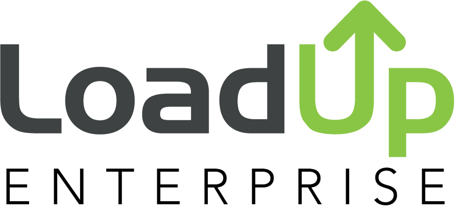

     

# LoadUp Partner API Examples

The LoadUp Partner API uses [GraphQL](https://graphql.org/). If you are familiar
with GraphQL, you can use any standard GraphQL library to interact with our API.
However, if you are less familiar with GraphQL, the LoadUp Engineering Team has
created these examples to help you get started. 

__Note:__ You can find the most updated information at on the [Partner API](https://order.goloadup.com/partner/integrations/overview) website.

## Language Specific Examples

[JavaScript](javascript/)  
[PHP](php/)  
[Ruby](ruby/)

__Are we missing a language you use? Let us know so we can add it!__

This project is lovingly maintained by the [LoadUp Technologies](https://www.goloadup.com) Engineering Team.
